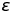
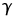
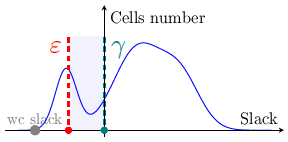
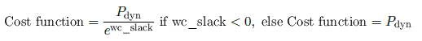

# Dual-VTH optimization script with gate resizing
This project, developed in the context of the _Synthesis and Optimization of Digital Systems_ course (Prof. Andrea Calimera, Politecnico di Torino, A.Y. 2018/'19), consists in a Tcl procedure to be embedded in Synopsys PrimeTime for a constrained multi-objective post-synthesis optimization of a netlist of standard cells. This algorithm has been awarded with the first place in the course contest, among  the other projects of the 2019 SODS course.

Given an input `savings` parameter, the `dualVth` procedure performs a dual-VTH cell assignment with gate resizing, with the aim to meet the constraint on the **leakage power** while looking for a tradeoff between **dynamic power** consumption and worst case **slack** in the **smallest possible time**. The backbone of the algorithm is a `while` loop divided into three main parts, described in the following.

### 1. Dynamic power - slack tradeoff
Firstly, a transformation aimed to improve the tradeoff between dynamic power and worst case slack is performed. A good approach proved to be to define two parameters,  and : the algorithm resizes to smaller all cells with `max_slack` > , to save dynamic (and leakage) power with non-critical cells, and to bigger the ones with `max_slack` < , to try to improve the worst case slack.
What remains defined is a _safe zone_ between  and , from which cells are not moved unless global changes affect them.

Note that cells are swapped to smaller or bigger only of one size at a time: this allows to explore more in detail the cost function; if a cell can be further resized it will indeed remain outside the safe zone, being subject to resizing in following iterations.
The parameter  is recomputed at each iteration as a function of the worst case slack; such dependency has been modeled empirically to try not to swap to bigger too much cells, which has negative outcomes.
As far as  is concerned, a good value turned out to be 0: since in most cases the worst case slack becomes negative, such transformation will not lead to further damages, while exploiting the higher possibility of size decreasing; also, if needed, cells with smallest slack will be anyway enlarged in following iterations if the cost function improves, and brought back to a positive slack.

### 2. Leakage constraint
In this phase, the leakage power constraint is enforced; the algorithm needs to repeat this step at each iteration since swaps in size of cells affect the design leakage. Since leakage power is a local property, a quick approach, which needs only two `update_power` calls, can be exploited.
The cells to swap to HVT alternatives are selected basing on a priority index, the product `cellLVT_slack · leak_diff`, as a tradeoff between HVT cells number and timing deterioration. Only LVT cells (and not cells previously swapped to HVT) are affected in this step.

### 3. Cost function evaluation
In this phase the current cost function is computed, and compared to the cost function of the previous iteration. If `currentCF` > `previousCF`, the loop is broken, supposing that the algorithm reached a local minimum. This might not be true, but this is a form of tradeoff between the quality of the result and the execution time. When a local minimum is found, the last performed iteration needs to be undone; dictionaries to quickly revert the changes are used for this purpose.
The cost function is computed as:

The loop is also broken if the number of iterations exceeds 6: this is another form of tradeoff to bound the execution time.
	
